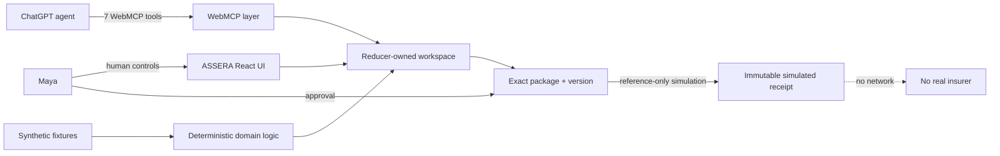
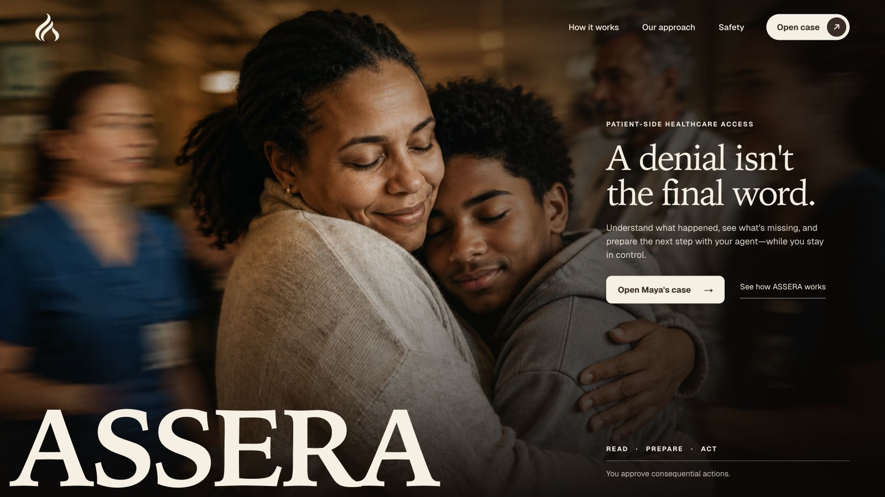
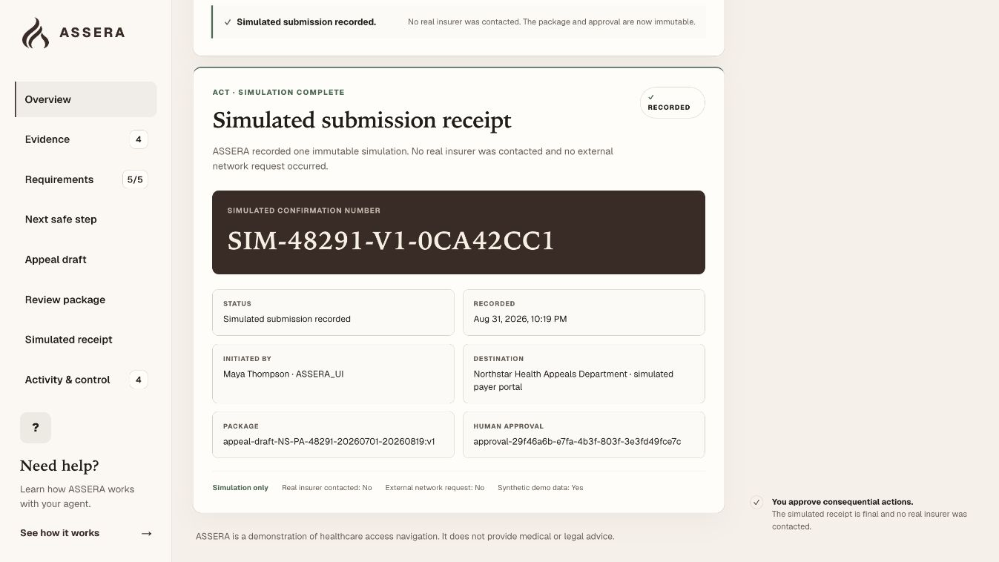

<p align="center">
  
</p>

# ASSERA

> **A denial isn’t the final word.**

Most healthcare AI tries to automate prior authorization for institutions.
ASSERA uses WebMCP to make the patient-facing website itself a structured agent
interface—so a person and their agent can understand a denial, prepare the next
step, and act together while the person retains control.

ASSERA is a human-centered, patient-side healthcare access platform for
navigating prior-authorization denials. The public experience uses a fully
synthetic patient, insurer, policy, and submission workflow. Its browser-native
WebMCP workspace helps a person understand a denial, identify missing
administrative information, prepare an exact package, retain human approval,
and record a simulated—not real—submission.

- **Public experience:** [https://assera-webmcp.stanleyzebulonp.chatgpt.site](https://assera-webmcp.stanleyzebulonp.chatgpt.site) — no login required.
- **Demo video:** `PUBLIC_YOUTUBE_URL_PENDING`
- **Direct synthetic case:** `/case/NS-PA-48291`

## Why this problem matters

KFF’s analysis of 2024 Medicare Advantage data reports nearly 53 million prior
authorization determinations, 4.1 million fully or partially denied requests,
an 11.5% appeal rate among denied requests, and an 80.7% partial/full overturn
rate among appealed denials. Those figures describe Medicare Advantage—not all
U.S. insurance—and an overturn does not prove the initial decision was improper.
See [verified sources](docs/SOURCES.md).

## People and agents work together

The agent can READ denial/policy/evidence/readiness, PREPARE a deterministic
local draft, inspect the exact package, and record simulated ACT only after the
human approves that package in ASSERA. Maya alone confirms treatment dates,
edits the statement, approves/revokes a package, and authorizes the exact
version. **ASSERA assists. Maya authorizes.**

WebMCP is essential because the website itself exposes current, structured,
state-aware tools. ChatGPT orchestrates conversation; ASSERA remains the source
of truth for evidence, deterministic rules, guarded mutation, provenance, and
visible activity.

### READ / PREPARE / CONTROL / ACT

- **READ** lets the agent inspect denial, policy, evidence, readiness, and the
  exact package without changing case information.
- **PREPARE** lets the agent create or reuse deterministic local content after
  the human supplies required facts.
- **CONTROL** belongs to Maya: she confirms dates, edits the statement, and
  approves or revokes an exact package version in the ASSERA UI.
- **ACT** records one local simulation only after that exact approval.

CONTROL is intentionally not a WebMCP tool. Giving the agent an approval tool
would collapse the boundary the product is designed to preserve.

## Synthetic case journey

1. Ask why the MRI was denied and what is missing: readiness is 4/5.
2. Ask to prepare too early: `PREPARE_BLOCKED`, no invented dates or draft.
3. Maya confirms July 1–August 19, 2026 in the UI: readiness becomes 5/5.
4. The agent prepares a deterministic local draft; nothing is submitted.
5. The agent previews the exact statement, four documents, shared information,
   package/version, approval, and submission status.
6. Maya approves the exact package version in ASSERA.
7. The agent passes only current references to simulation-only ACT, producing
   one immutable receipt. No real insurer is contacted.

Refresh resets the ephemeral synthetic workspace.

## Architecture



See [WebMCP architecture](docs/WEBMCP_ARCHITECTURE.md) and the
[threat model](docs/THREAT_MODEL.md).

## Seven WebMCP tools

| Tool | Class | Contract |
|---|---|---|
| `get_denial_details` | READ | Decision, reason, deadline |
| `get_coverage_requirements` | READ | Fictional administrative criteria; no medical judgment |
| `list_appeal_evidence` | READ | Structured available evidence |
| `check_appeal_readiness` | READ | Deterministic complete/incomplete comparison |
| `preview_appeal` | READ | Exact untrusted package content and status |
| `prepare_appeal` | PREPARE | Create/reuse local draft or return truthful block |
| `submit_appeal` | ACT | Exact reference-only simulation after human approval |

There is no WebMCP tool to confirm dates, edit, approve, revoke, replace package
content, contact a real payer, cancel, or resubmit.

## ChatGPT companion

`plugins/assera/` packages a branded companion that exposes exactly one
read-only MCP tool: `show_assera_demo`. It opens and explains the public
synthetic case; it does not mirror case state or duplicate the website's seven
WebMCP tools. The website remains authoritative for the workflow and all human
controls.

## Safety boundary

- one fictional case and fictional insurer/policy/providers;
- no uploaded record, PHI, real identifier, or real payer connection;
- strict schemas with no extra ACT properties;
- exact case/package/version/approval binding;
- human-only approval with UI provenance;
- one idempotent, concurrency-safe, immutable simulated receipt;
- execution cancellation before commit;
- prompt/XSS-shaped statement content rendered as inert text;
- no medical/legal advice, medical-necessity decision, or success prediction;
- no claim of HIPAA compliance or production readiness.

## Local setup

Node.js 22.13+ is required; release validation used 22.23.1.

```bash
npm ci
npm run dev
```

Then open `http://localhost:3000` (or the port printed by the dev server).

Validation:

```bash
npx tsc --noEmit --incremental false --allowImportingTsExtensions
npm run lint
npm test
npm run build
```

## WebMCP testing

Use ChatGPT’s in-app browser where WebMCP is supported. In compatible Chrome,
use the challenge-required WebMCP version/flag/extension setup. Open the case
route, verify exactly seven tools, and follow the [judge testing instructions](submission/TESTING_INSTRUCTIONS.md).

The UI remains functional when `document.modelContext` is unavailable; the
human fallback uses the same domain command and still records only a simulation.

## Evals and release evidence

Deterministic tests cover READ/PREPARE/CONTROL/ACT contracts, all adversarial
reference failures, extra ACT properties, prompt injection, idempotency,
concurrency, cancellation, finalization, fallback, no-network behavior, and
rendered routes. Live IAB results currently record 45 rows: 37 PASS, 3 FAIL,
5 NOT_RUN. The original ACT argument failure remains recorded, and one
authorized post-fix ACT journey passed; Chrome remains an explicit gap. See
[evaluation details](docs/EVALUATIONS.md) and
[`live-agent-results.json`](evals/live-agent-results.json).

<p>
  
  
</p>

## Repository map

- `app/`, `components/` — pages and human UI
- `data/` — immutable synthetic fixtures
- `domain/` — deterministic state and safety rules
- `webmcp/` — seven page-defined tool contracts and registration
- `tests/`, `evals/` — deterministic and live evaluation evidence
- `docs/` — architecture, security, release, access, and QA audits
- `submission/` — Devpost copy, script, shot list, testing, and checklist
- `artifacts/release-candidate/` — curated visual evidence

## Known limitations

One synthetic case; ephemeral in-memory state; no ASSERA-owned production auth,
database, real insurer integration, or clinical validation. Chrome remains
unobserved in this environment.

## License and author

Software source is licensed under [Apache-2.0](LICENSE). The ASSERA name,
wordmark, and logo remain brand identifiers; see [NOTICE](NOTICE). Third-party
dependencies keep their own licenses.

Created by **Penuel Stanley-Zebulon** for the 2026 WebMCP Challenge.
