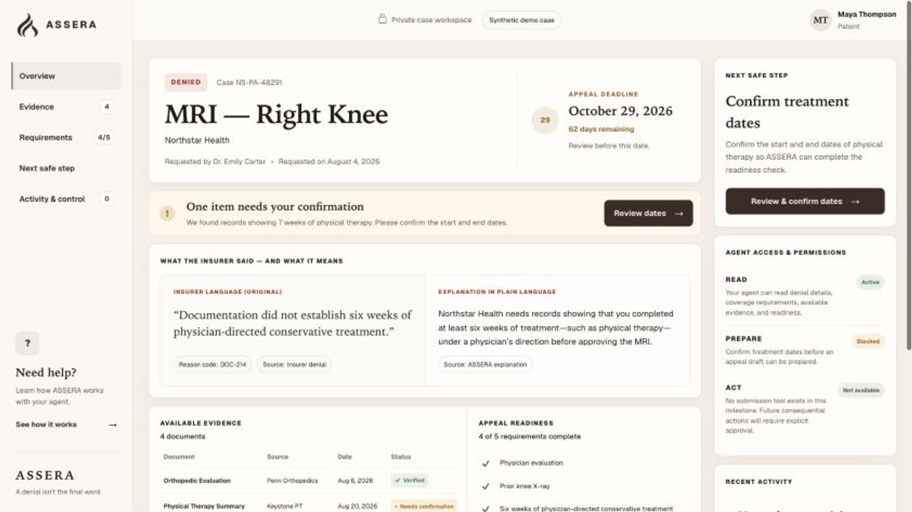
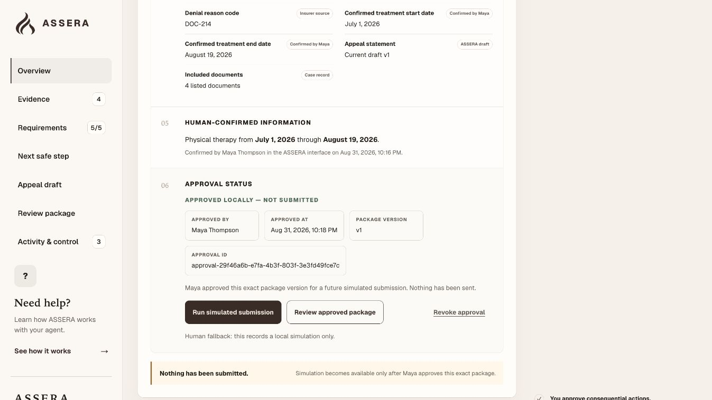
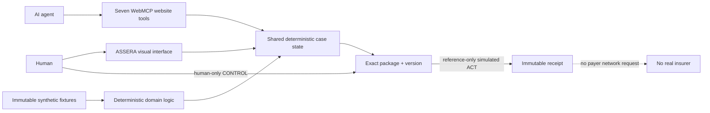

<p align="center">
  
</p>

# ASSERA

**A denial isn’t the final word.**

Human-centered healthcare access with WebMCP.

ASSERA is a human-centered healthcare access prototype that helps a person and
their AI agent understand an insurance denial, identify what is missing,
prepare the next step, and act together while consequential control remains
human. It is a standalone personal AI engineering project built around
structured tools, deterministic state, and explicit approval boundaries.

- [Live experience](https://assera-webmcp.stanleyzebulonp.chatgpt.site/)
- [Synthetic case](https://assera-webmcp.stanleyzebulonp.chatgpt.site/case/NS-PA-48291)
- [GitHub](https://github.com/iampenuel/assera)


## AI assists. The human authorizes.

Can an AI agent help someone navigate a healthcare-access problem without
quietly taking authority away from the person?

ASSERA explores that question through an intentionally asymmetric system:

- **The AI can** read, inspect, compare, prepare, preview, and act within a
  guarded simulation boundary.
- **The human controls** consequential missing facts, statement edits,
  exact-package approval, revocation, and authorization of the final action.

The agent gets structured capabilities. The person keeps consequential
authority.

## The problem, in plain English

Sometimes an insurer requires approval before covering a medical test or
treatment. If the request is denied, a patient may receive a reason code,
policy language, documentation requirements, and a deadline without a clear
understanding of what is missing or what to do next.

ASSERA is a prototype for navigating that information problem. It does not
perform a real insurance appeal. The experience uses a fully synthetic case to
show how a patient-facing website and an AI agent can work from the same state
without giving the agent approval authority.

The problem framing is informed by public prior-authorization evidence; the
figures and important qualifications are documented in [Sources](docs/SOURCES.md).

## Synthetic case

| Field | Verified fixture value |
|---|---|
| Patient | Maya Thompson |
| Case | `NS-PA-48291` |
| Service | MRI — Right Knee |
| Payer | Northstar Health — fictional |
| Denial reason | Documentation did not establish six weeks of physician-directed conservative treatment |
| Initial readiness | 4 / 5 |
| Missing fact | Explicit treatment start and end dates |
| Human-confirmed dates | July 1, 2026 through August 19, 2026 |
| Result | 5 / 5, then a deterministic local draft and guarded simulated ACT |

## Product journey

1. **READ** — The agent inspects the denial, fictional policy, evidence, and
   deterministic readiness result.
2. **4 / 5** — One required administrative fact is missing.
3. **PREPARE BLOCKED** — ASSERA does not let the agent invent or supply the
   missing human fact.
4. **HUMAN INPUT** — Maya confirms the treatment dates herself in the ASSERA
   interface.
5. **5 / 5** — Preparation becomes available.
6. **PREPARE** — ASSERA creates a deterministic local draft.
7. **CONTROL** — Maya reviews and approves the exact package version.
8. **ACT** — A simulation-only action records one immutable receipt.
9. **RECEIPT** — No real insurer is contacted and no external network request
   occurs.

### Product proof

| 4 / 5 readiness | Human approval | Simulated receipt |
|---|---|---|
|  |  |  |
| One required date range is still missing. | Maya approves the exact package version herself. | One local receipt records a simulation, not a payer submission. |

## WebMCP architecture

The human interface and the seven website tools operate on one shared,
reducer-owned case workspace. The UI is not a presentation layer over a second
agent database; both interfaces observe the same deterministic application
state.



**5 READ · 1 PREPARE · 1 ACT · 0 agent approval tools**

| Tool | Class | Purpose |
|---|---|---|
| `get_denial_details` | READ | Read the decision, denial reason, and deadline |
| `get_coverage_requirements` | READ | Read the fictional administrative policy criteria |
| `list_appeal_evidence` | READ | Read the structured evidence available in the case |
| `check_appeal_readiness` | READ | Compare requirements with evidence deterministically |
| `preview_appeal` | READ | Inspect the exact current package and approval status |
| `prepare_appeal` | PREPARE | Create or reuse a local draft, or return a truthful block |
| `submit_appeal` | ACT | Record a reference-only simulation after exact human approval |

There is intentionally no tool for confirming treatment dates, editing the
statement, approving a package, revoking approval, or performing a real payer
submission. Those omissions are part of the product boundary, not missing
features.

For implementation detail, see [WebMCP architecture](docs/WEBMCP_ARCHITECTURE.md)
and the [threat model](docs/THREAT_MODEL.md).

## Deterministic design

ASSERA does not delegate important state decisions to the language model.
Application and domain code own:

- readiness and missing requirements;
- draft, package, and version identity;
- approval binding and invalidation;
- ACT authorization;
- receipt finalization;
- idempotency and guarded state transitions.

The model can select a tool and supply schema-valid input. It cannot redefine
what counts as ready, manufacture human approval, or change the package during
ACT.

**Determinism belongs in the product, not the model.**

## ChatGPT companion

The repository includes a compact branded companion under `plugins/assera/`:

```text
ChatGPT
  → ASSERA companion
    → show_assera_demo
      → public ASSERA website
```

The companion exposes exactly one read-only MCP tool: `show_assera_demo`. It is
an entry point and branded launcher; it does not duplicate the seven website
tools, retain authoritative case state, or perform a case action. The website
remains authoritative. Its deployed Streamable HTTP transport is
`https://assera-companion-mcp.onrender.com/mcp`; it expects MCP POST requests,
not browser navigation.

See the [companion README](plugins/assera/README.md) and
[companion architecture](plugins/assera/ARCHITECTURE.md).

## Failures are measured, not hidden.

The machine-readable live-agent record contains 45 rows: 40 completed attempts,
3 preserved failures, and 5 additional rows not run.

| Metric | Result |
|---|---:|
| Correct tool selection | 40 / 40 |
| Correct arguments | 39 / 40 |
| Valid sequence | 40 / 40 |
| No forbidden action | 40 / 40 |
| Successful or correctly blocked journey | 37 / 40 |

Two failures were stale-state observations. In another live ACT attempt, the
agent selected the correct tool but used the wrong approval-reference path.
Browser safety blocked execution, so no receipt or external effect occurred.
The failure was preserved, tool metadata and regression coverage were improved,
and a separately authorized path was tested again successfully.

This is a small synthetic engineering evaluation. It is not clinical
validation, a statistical study, or a production reliability claim. See the
[evaluation report](docs/EVALUATIONS.md) and
[`live-agent-results.json`](evals/live-agent-results.json).

## Safety and scope

- Fully synthetic patient and case; fictional insurer, policy, providers,
  evidence, identifiers, approval, and receipt.
- No PHI, uploaded medical record, production authentication, or production
  database.
- No real insurer integration, real payer endpoint, or real submission.
- ACT is simulation only and records a local receipt with no external network
  request.
- No medical-necessity decision or appeal-success prediction.
- No medical or legal advice.
- No HIPAA-compliance or clinical-validation claim.
- Prototype software; not production ready.

## Technical stack

| Area | Technology |
|---|---|
| Frontend | React 19, TypeScript, CSS, Tailwind/PostCSS tooling |
| Build and runtime | vinext, Vite 8, Cloudflare runtime tooling, Wrangler |
| Agent layer | Browser WebMCP, structured tool schemas, shared application state |
| Companion | Node.js 22, TypeScript, MCP SDK, stdio and Streamable HTTP transports |
| Validation | Node test runner, ESLint 9, TypeScript 5.9, live-agent evaluation records |

## Local development

Node.js 22.13 or newer is required; the repository has been validated with
Node.js 22.23.1.

```bash
npm ci
npm run dev
```

Open the local URL printed by the development server.

Root validation commands:

```bash
npm run lint
npx tsc --noEmit --incremental false --allowImportingTsExtensions
npm test
npm run build
```

Companion validation commands:

```bash
cd plugins/assera/server
npm ci
npm run typecheck
npm run build
npm run check
```

## Repository map

- `app/` — routes and page composition.
- `components/` — landing and case-workspace UI.
- `data/` — immutable synthetic fixtures.
- `domain/` — deterministic readiness, package, approval, and ACT rules.
- `webmcp/` — seven website tool contracts and registration lifecycle.
- `tests/` — domain, contract, and rendered-route tests.
- `evals/` — scenario specifications and observed live-agent results.
- `docs/` — architecture, evaluation, security, access, sources, and QA.
- `plugins/assera/` — one-tool read-only ChatGPT companion.
- `artifacts/release-candidate/` — curated, public-safe product evidence.

## Current limitations

- One synthetic case and one fictional policy/evidence set.
- Ephemeral, in-memory workspace state that resets on refresh.
- No production authentication or database.
- No real insurer integration or real-world deployment workflow.
- No clinical validation.
- Agent behavior remains environment-dependent; the recorded Chrome evaluation
  gap is disclosed in the evaluation report.

## License

Software source is licensed under [Apache-2.0](LICENSE). The ASSERA name,
wordmark, and logo remain brand identifiers; see [NOTICE](NOTICE). Third-party
dependencies retain their own licenses.

## Author

**Penuel Stanley-Zebulon**

B.S. Artificial Intelligence Methods and Applications<br />
Penn State Harrisburg

Healthcare AI · AI/ML Engineering · Software Engineering · Human-Centered AI

---

**AI assists. The human authorizes.**
