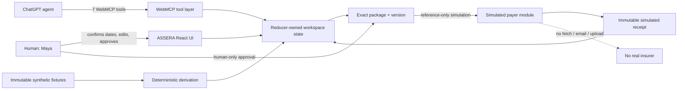

# WebMCP architecture

ASSERA is a browser-native, state-aware website. ChatGPT supplies conversation
and orchestration; ASSERA supplies the canonical case state, deterministic
domain logic, human controls, and visible audit trail.

## State and derivation

`domain/case-workspace.ts` owns the shared live state and is the only mutation
boundary. Immutable fixtures in `data/` define the fictional case, evidence,
and Northstar policy. Treatment-date confirmation creates effective evidence;
`domain/readiness.ts` deterministically maps that evidence to five
administrative requirements.

At 4/5, preparation returns a typed `PREPARE_BLOCKED` outcome and records a
truthful blocked activity. After Maya confirms July 1–August 19, 2026 in the
UI, readiness becomes 5/5. `domain/appeal-draft.ts` creates a deterministic,
local, explicitly unsubmitted statement. No model writes the draft.

## Package, approval, and ACT

`domain/appeal-package.ts` builds a pure review snapshot from current state.
Package identity derives from draft identity and version. A material statement
edit increments the draft/package version and clears any prior approval; a date
change invalidates both draft and approval.

Only the ASSERA UI can create an approval. Approval binds:

- case ID;
- draft ID and version;
- package ID and version;
- Maya as the human actor;
- `ASSERA_UI` provenance;
- `SIMULATED_SUBMISSION` scope.

`submit_appeal` accepts only those references plus `mode: "simulation"`. It
cannot accept statement text, destination, documents, dates, approval booleans,
or notes. `domain/simulated-payer.ts` validates every reference against current
state. The first valid call atomically stores one receipt; an exact repeat
returns the same object. Concurrent calls observe one shared record. An aborted
execution is checked before commit.

After ACT, the date confirmation, draft, package, approval, and receipt are
finalized. Preview reads the stored snapshot. Refresh intentionally resets the
ephemeral synthetic workspace.

## No-network boundary

Simulation produces a local receipt only. It does not call `fetch`, email,
upload a document, invoke a webhook, or contact an insurer. The receipt and UI
say `real_insurer_contacted: false` and `external_network_request: false`.
Automated tests replace `fetch` with a failing sentinel around preparation and
ACT.

## Seven-tool inventory

| Tool | Taxonomy | State effect |
|---|---|---|
| `get_denial_details` | READ | Read activity only |
| `get_coverage_requirements` | READ | Read activity only |
| `list_appeal_evidence` | READ | Read activity only |
| `check_appeal_readiness` | READ | Read activity only |
| `preview_appeal` | READ | Read activity only; output is untrusted content |
| `prepare_appeal` | PREPARE | Local draft create/reuse or truthful block |
| `submit_appeal` | ACT | One local simulated receipt after exact human approval |

All tools register through one `document.modelContext` lifecycle and one
registration `AbortSignal`. If WebMCP is unavailable, the human UI remains
usable and runs the same domain commands for preparation, approval, and
simulated ACT.

## Activity taxonomy

- **READ** — agent inspected state; no information changed.
- **PREPARE** — human confirmed dates or agent/human prepared local content.
- **CONTROL** — Maya approved or revoked an exact package version.
- **ACT** — simulated receipt was recorded, reused, or safely blocked.

## Website and companion boundary

WebMCP is a core architectural integration: seven tools live in the page and
operate on the page’s current state. The repository also includes a branded
ChatGPT companion with one read-only MCP launcher tool, `show_assera_demo`, and
the resource `ui://widget/assera-demo-v3.html`. The companion does not read,
mirror, or mutate case state; it directs people to the public website, which
remains the authoritative workflow surface.
